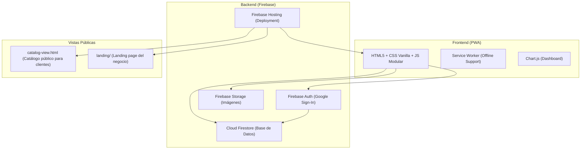

  <h1>🧪 Alchemy Vault</h1>
  
<em>Sistema de Inventario, Punto de Venta y Gestión Comercial para Tienda de Belleza</em>

  
  
  
  

---

## 🎯 El Problema

Una tienda de belleza con productos importados (skincare, maquillaje, electrónicos) necesita llevar el control de:
- Stock físico por producto y categoría
- Precios de costo vs precio de venta (margen/ganancia)
- Ventas del día con múltiples métodos de pago simultáneos
- Clientes con deudas pendientes ("fiados")
- Órdenes de recompra a proveedores

Hacerlo en hojas de Excel o anotaciones manuales genera errores, pérdida de datos y pérdida de tiempo valioso.

**Alchemy Vault** reemplaza todo eso con una PWA accesible desde cualquier dispositivo con internet.

---

## ✨ Módulos del Sistema

### 📊 Dashboard Principal
Panel de control en tiempo real con KPIs críticos del negocio:

| KPI | Descripción |
|---|---|
| 💰 **Inversión Total** | Suma del costo de todo el inventario actual |
| 🛒 **Ventas Totales** | Ingresos acumulados del período |
| 📈 **Ganancia Neta** | Diferencia entre ventas e inversión |
| ⚠️ **Stock Bajo** | Productos que requieren reabastecimiento |
| 🤝 **Por Cobrar** | Total de deudas pendientes de clientes |
| 🎁 **Costo Regalos** | Control de promociones y regalos |

Incluye **gráfica de ventas recientes**, **top productos más vendidos** y **distribución mensual** con Chart.js.

---

### 📦 Inventario
- CRUD completo de productos con categorías: Skin Care 💆‍♀️, Rostro 🎨, Ojos 💄, Labios 💋, Electrónicos 🔌, Combos 🎁
- Precio de costo, precio de venta y % de ganancia calculado automáticamente
- Sugerencia automática de precio (regla ×3 del proveedor)
- Galería de fotos múltiples por producto (subida a Firebase Storage)
- **Importación desde texto** (facturas del proveedor en formato Producto | Cantidad | Costo)
- **Auditoría guiada**: flujo paso a paso para actualizar el stock físico contado

---

### 🛒 Punto de Venta (POS)
- Grilla de productos con búsqueda y filtro por categoría
- Carrito de compras con subtotales y ganancia en tiempo real
- **Pagos múltiples simultáneos** en una misma venta:
  - Efectivo ($), Efectivo (Bs), Pago Móvil, Zelle, Punto de Venta, Transferencia
  - **"Pendiente (Fiado)"** — registra deuda automáticamente en Cuentas por Cobrar
  - Regalos/Promos — descuenta del costo de regalos separado
- Nombre del cliente opcional para trazabilidad

---

### 📋 Historial de Ventas
- Lista completa de transacciones con fecha, productos, monto y vendedor
- Ticket digital imprimible por venta
- Posibilidad de anular/editar una venta registrada

---

### 💸 Cuentas por Cobrar
- Lista de clientes con saldo pendiente
- Registro de abonos parciales con método de pago y referencia
- Resumen del total por cobrar en tiempo real

---

### 🚚 Compras / Restocks
- Registro de órdenes de recompra por proveedor
- Histórico de inversiones para análisis de rotación de inventario

---

## 🏗️ Arquitectura

---

## 🛠️ Stack Tecnológico

| Componente | Tecnología | Decisión |
|---|---|---|
| **Frontend** | HTML5 + CSS3 + JavaScript Vanilla | Sin build steps. Máxima velocidad de carga, sin dependencias |
| **Base de Datos** | Firebase Firestore | Tiempo real, sin servidor que gestionar, escalable |
| **Autenticación** | Firebase Auth (Google) | Login seguro sin contraseñas propias que gestionar |
| **Almacenamiento** | Firebase Storage | Imágenes de productos en la nube |
| **Hosting** | Firebase Hosting | CDN global, HTTPS automático, despliegue en segundos |
| **Gráficas** | Chart.js | Ligero, sin frameworks |

---

## 🔐 Seguridad

- Acceso solo para **cuentas de Google autorizadas** (whitelist en Firestore Rules)
- El catálogo público (`catalog-view.html`) es de solo lectura, sin acceso a precios de costo ni datos financieros
- Reglas de Firestore con restricción por UID de usuario

---

> Desarrollado por **Gustavo Matheus** · *Full Stack Developer*
